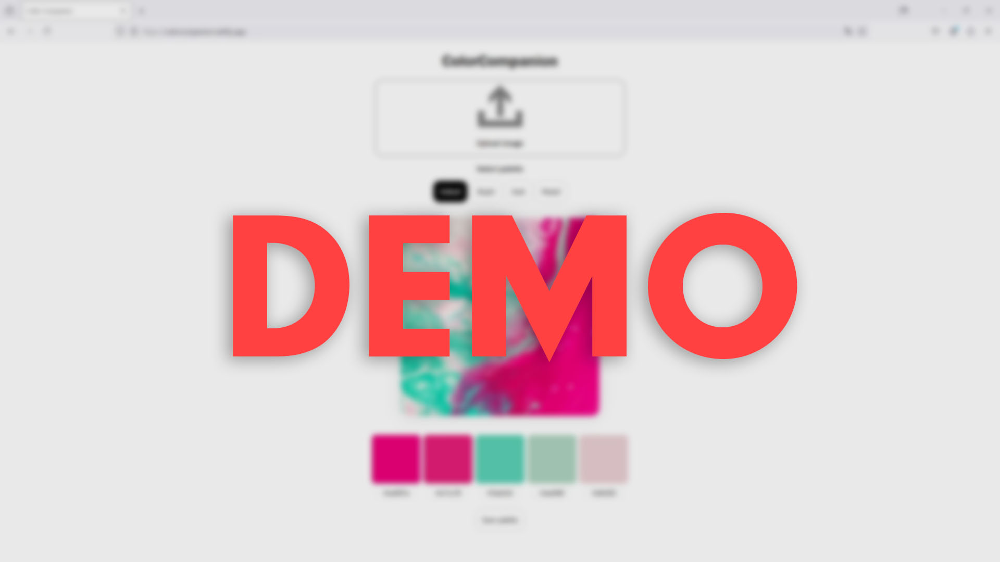
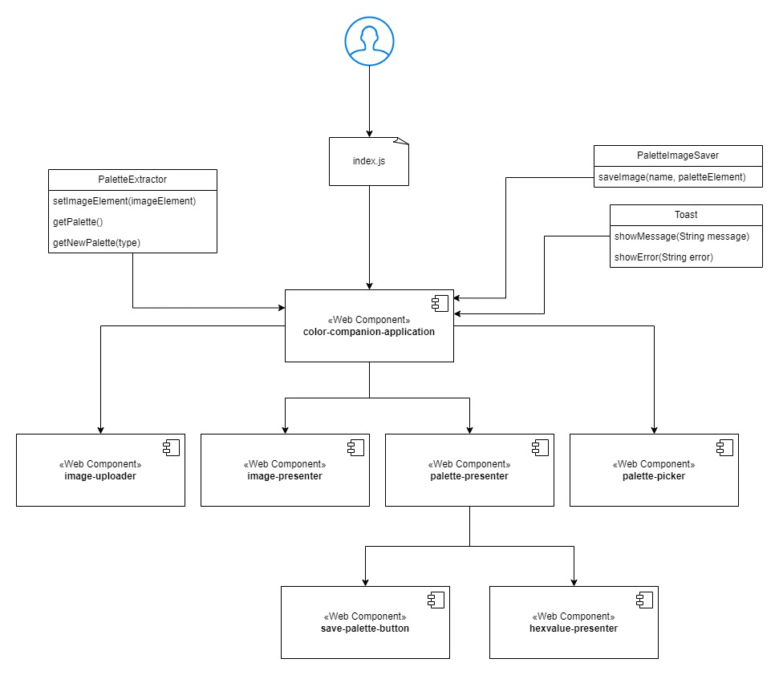
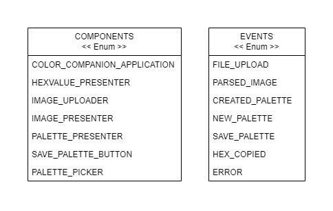

## ColorCompanion

### Description
ColorCompanion is your new... Color Companion!
This is a web application aimed at web developers and digital designers to help with the design process.

#### Ever had trouble picking colors for a project?
With this tool you can extract color palettes from an image with colors you already like.
The palette can then be saved to an image so you can import it into a design software and use a colordropper to get the colors.
You can also get each color manually via the hex codes under each color in the palette. Click a hex code and paste it into a css file or design software to use it.

See [vision](vision.md) and [requirements](kravspecifikation.md) to see tha plan of this application. - In swedish.

### Usage
#### Demo video - Opens in same tab
[](https://youtu.be/vk7zFJTC2Zc)

#### How to use 
- Press the upload icon / Drag & Drop an image on it
- Select Default, Bright, Dark or Muted palette
- Copy hex codes 
- Press "Save Palette" to save image


#### Try it
[Color Companion](https://colorcompanion.netlify.app/)

#### Run it locally:
Clone it!

```
 $ git clone https://github.com/RobinPett/1dv610_lab3.git
 ```

 Open the project folder and run:
 ```
 $ npm install
 ```
 Star a local development server:
 ```
 $ npm run dev
 ```
 Click the local adress and try it in your browser!


### Architecture


This webapplication is built up by vanilla javascript components.
The main component - `color-companion-application` orchestrates the sub components and handles overlapping logic. The subcomponents handle presentation of images and palettes as well as some basic UI. 

#### Abstraction of dependencies
The dependencies from [requirements](#requirements) are abstracted with following classes:

- `Toast` - Displays Information/error messages.
- `PaletteImageSaver` - Converts a palette element to an image and triggers it to download.
- `PaletteExtractor` - Takes an imageURL as input and extracts palettes in different styles - Default, Bright, Dark, Muted.

The webapp uses these following enumerations to name components and their respective events.



### Requirements
This application is built with Javascript ES6 and is dependent on the following npm packages:
- html2canvas
- toastify-js
- color-palette-extractor

#### Packages used in development
- vite
- eslint

### Test report
See latest - In swedish - [testreport](testrapport.md)

### License
MIT @Robin Pettersson 2024