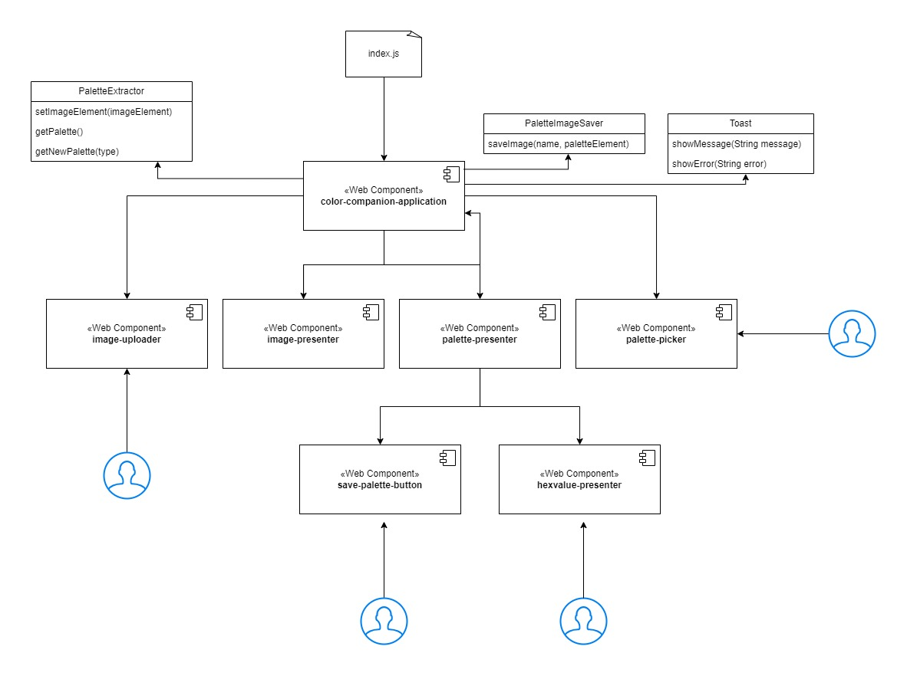

## ColorCompanion

### Description
ColorCompanion is your new... ColorCompanion!
This is a web application aimed at web developers and digital designers to help with the design process.

#### Ever had trouble picking colors for a project?
With this tool you can extract color palettes from an image which colors you already like.
The palette can then be saved to an image so you can import it into a design software and use a colordropper to get the colors.
You can also get each color manually via the hex codes under each color in the palette. 

### Usage
- Demo video

Try it! [Color Companion](https://colorcompanion.netlify.app/)

### Architecture

This webapplication is built up by vanilla javascript components.
There's a main component - `color-companion-application` which orchestrates the others and handles overlapping logic.

The webapp uses these following enumeration to name components and their respective events.

### Requirements
This application is built with Javascript ES6 and is dependent on the following npm packages:
- html2canvas
- toastify-js
- color-palette-extractor

#### Packages used in development
- vite
- eslint

### License
