# Reflektion

## Kapitel 2 - Meaningful names
Med variabelnamn och funktionsnamn har jag försökt koppla till problem domänen kring bilder
och färger. Color Palette, Pixels, RGB och vara avsikts visande. För att undvika magiska
nummer så använder jag konstanter för till exempel threshold i K-cluster-algoritmen. Jag
använder mig av förkortningar ibland men håller mig till kända såsom i för index och URL samt
rgb för röd, grön och blå. Jag undviker även string dependencies på komponent namn samt
event namn genom att sätta de som konstanter.

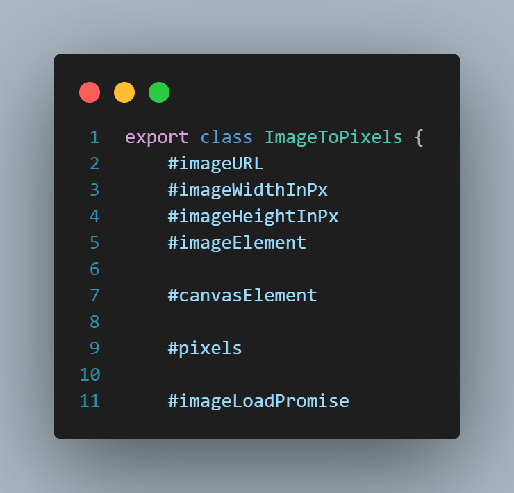
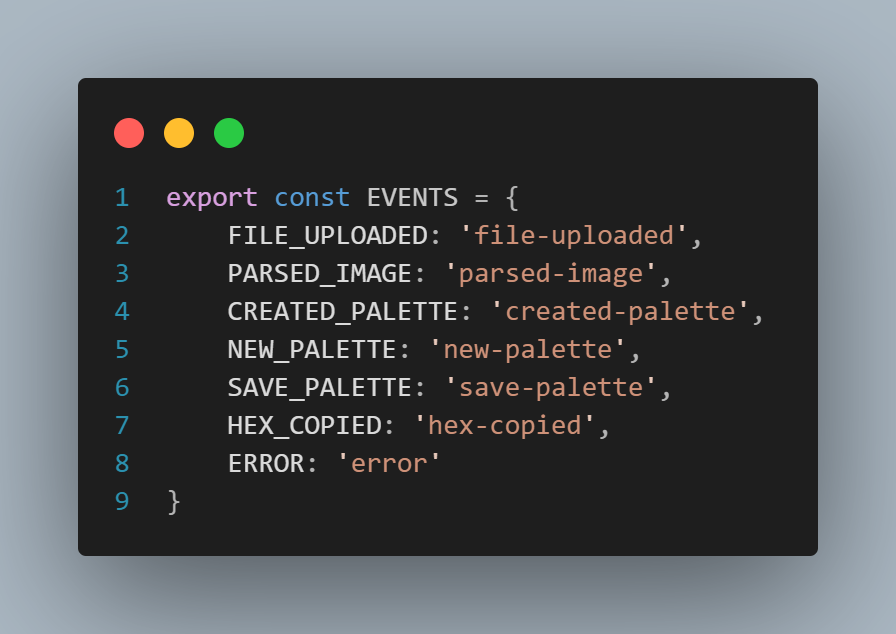
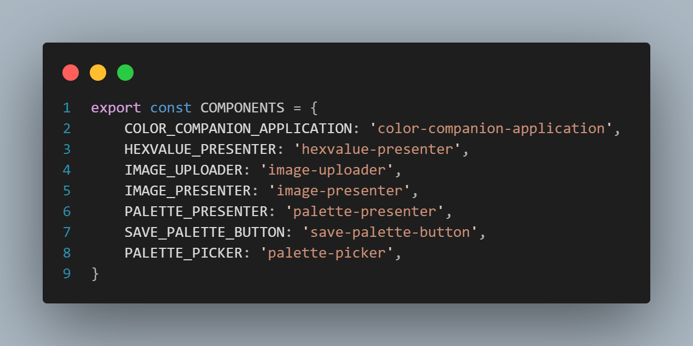

## Kapitel 3 - Functions
Funktionerna försöker jag hålla små och att de endast ska “Do one thing” utan att ha med
sidoeffekter - savePalette() Abstraktionsnivån hålls så hög som möjligt och låg abstraktions kod
ligger i separata metoder/funktioner. Som mest har jag dyadic antal argument i mina metoder
men strävar efter niladic. När jag behövt skicka in flera värden t.ex. en pixels brightness och
saturation så har jag lagt ihop dessa i ett objekt och då får jag en monadic metod. Jag använder
mig av command & query seperation för att separera på metoder som hämtar information och
skickar information - getPalette() - displayToastError()

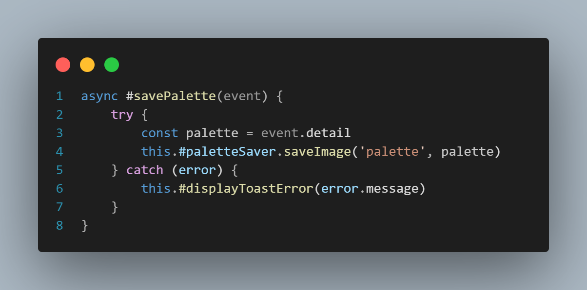
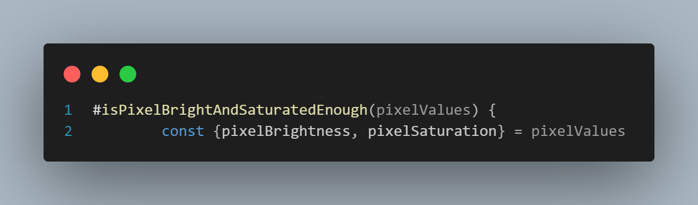
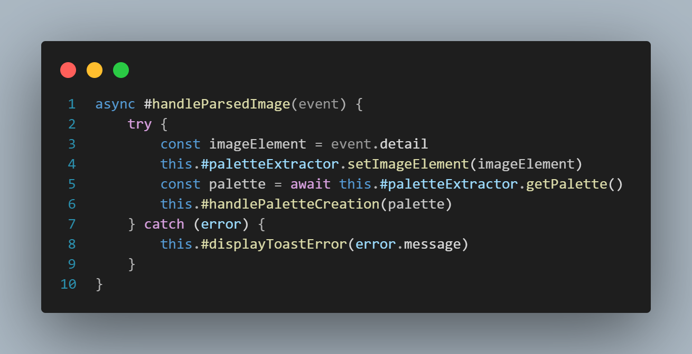

## Kapitel 4 - Comments
Jag har försökt få koden självförklarande med namngivning och har JSDOC på publika
metoder/funktioner riktade mot andra utvecklare. Vissa privata metoder är även dokumenterade
för mig själv under utveckling men det är inget som är “mandated” av min linting. Inline
kommentarer ligger för att klargöra och förklara mer komplex kod. T.ex vad Convergence är i
K-cluster algoritmen.

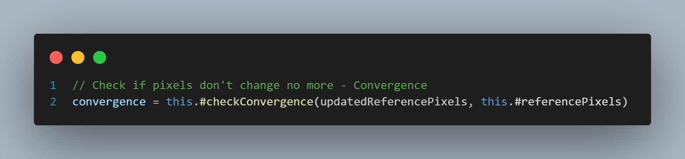

## Kapitel 5 - Formatting
Jag har försökt skriva metoder i klasserna med hög abstraktion först som ska kunna läsas som
ett händelseförlopp / tidningsartikel. De abstrakta metoderna kallar metoder under som i sin tur
kallar egna metoder och skapar ett träd av “Caller calling callee”. Detta fungerar bra i början
men det kan bli extremt många metoder och flera metodanrop man måste hoppa runt mellan.
Jag försöker även gruppera ihop relevanta variabler/metodanrop med horisontell densitet i
metoder för att kommunicera vad som är relaterat och inte. Detsamma med horisontell
öppenhet, för att separera koncept.

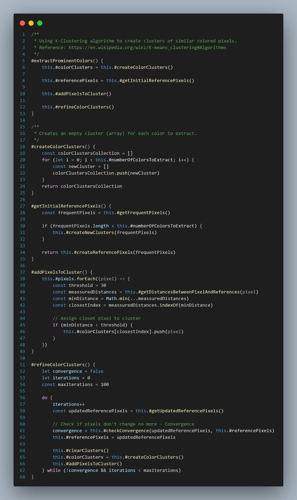

## Kapitel 6 - Objects & Data Structures
I appen har jag en egen painted type - (ColorPalette) - som ett objekt med sin egna interna
logik. Med den kan jag kapsla in kod som validerar om en palett är enligt min mentala modell.
Nu skapas typen i appen, jag kunde ha gjort typen redan i modulen men nu har jag lagt till
funktionalitet som har med applikationen att göra - hex konvertering.

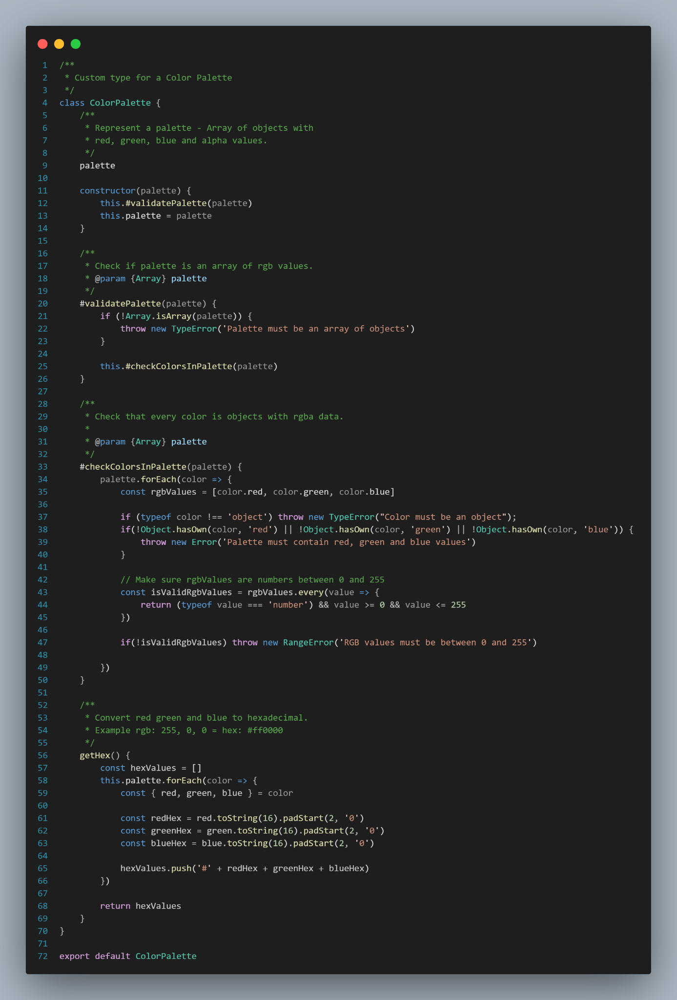

## Kapitel 7 - Error Handling
På flera ställen så kastar jag fel (exceptions) istället för att logga fel och skapa “clutter” i loggen.
Nu skapar jag inte egna fel utan använder de som redan existerar, Error, TypeError och
RangeError som jag sedan fångar och hanterar. Jag skapar kontext med mina fel genom att
beskriva vad som gick fel och tillägger felmeddelandet. Nu skapar jag även ERROR event i min
webbapplikation för att kunna skapa toast meddelande till användaren. Jag blandar i nuläget
felmeddelande som är riktade mot utvecklare och användare vilket borde separeras.

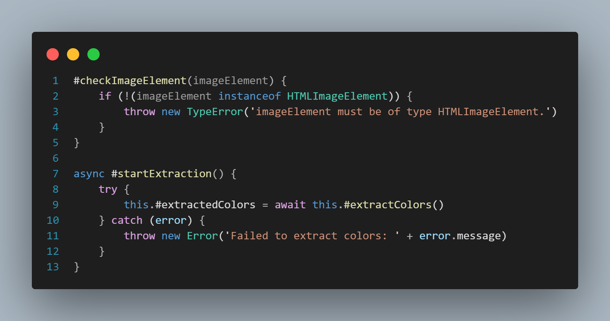
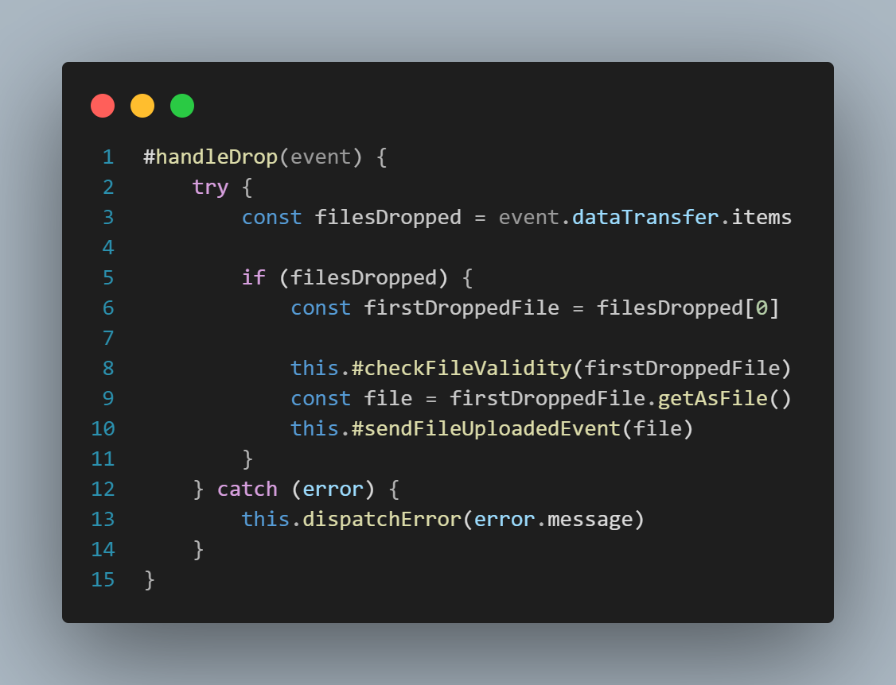

## Kapitel 8 - Boundaries
Jag är beroende av tre npm paket, min egen color-palette-extractor, Toastify-js och
html2canvas. Dessa har jag kapslat in i egna klasser med ett nytt interface för att använda i min
app. Det skapar tydliga gränser mellan min kod och tredje-part kod och gör det modulärt. Jag
kan t.ex. byta ut Toast modulen till en annan och ännu ha kvar metoderna showMessage och
showError men byta ut den interna logiken.

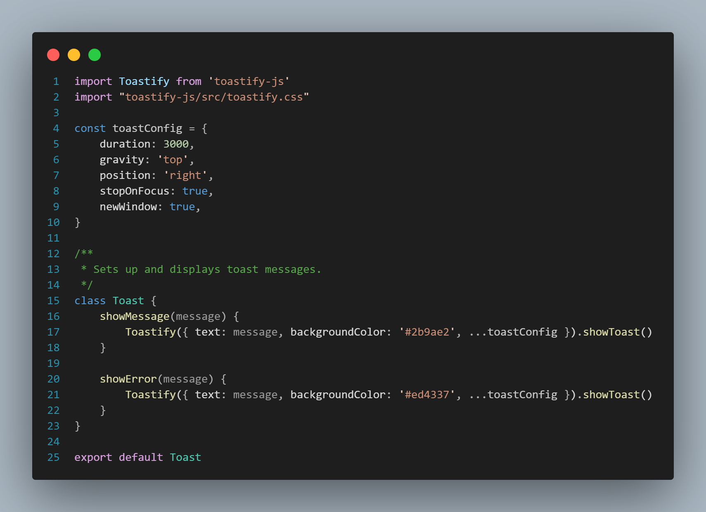

## Kapitel 9 - Unit Tests
Jag har skrivit enhetstester med Jest för att testa klasserna i modulen och dess funktionalitet.
Vid första iterationen av applikationen skrevs testerna efter koden så jag följde inte Test Driven
Development då. Men under re-faktoriseringen av modulen så var testerna behjälpliga för att se
om jag förstörde funktionalitet. Jag testar ett koncept/beteende i taget och använder så få
expect (assert) för att validera. Följer för det mesta F.I.R.S.T principerna, lite långsamt kanske,
men test coverage resultatet visar tydligt om det är pass eller fail och täckningen av testerna.

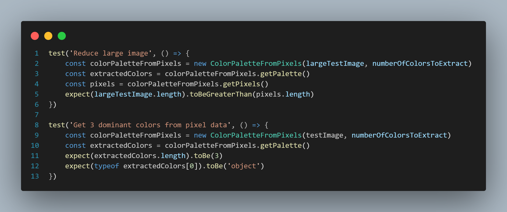
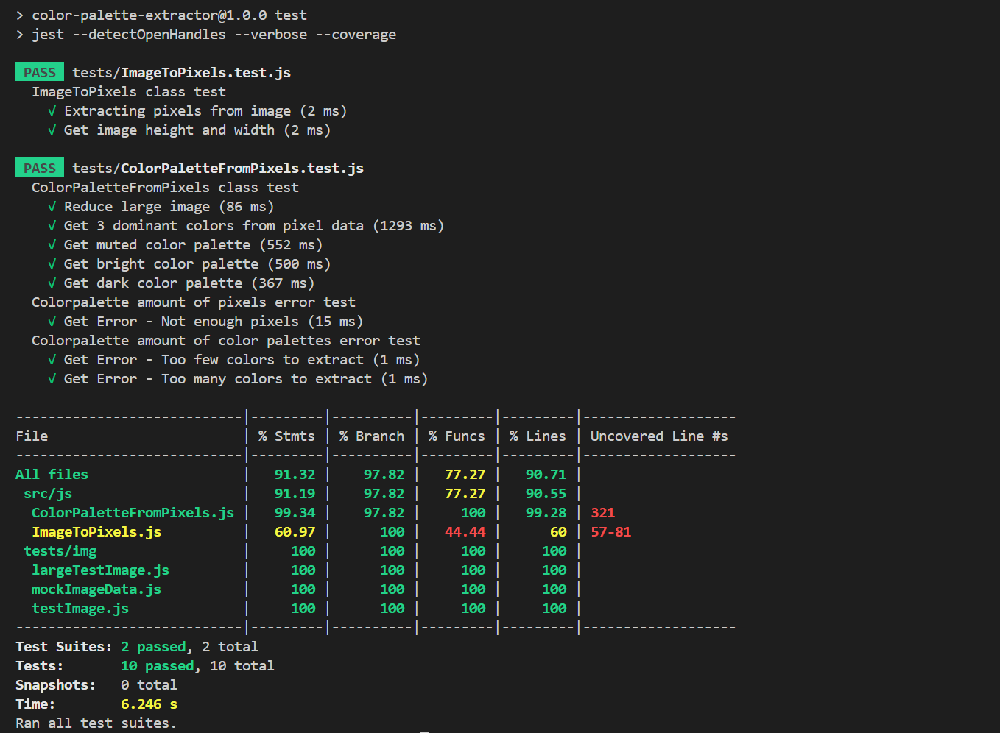

## Kapitel 10 - Classes
Klasserna jag har är för det mesta små, den största är ColorPaletteFromPixels som är 400 rader
lång vilket borde kunna simplifieras eller delas upp i fler klasser. Komponenterna i webbappen
ColorCompanion följer reglerna kring att klasser ska vara små, sammanhållna och endast
ansvara för en sak (SRP). Exempelvis image-uploader och image-presenter som båda hanterar
bilder men ansvarar separat för uppladdning eller presentation.
Jag har en abstrakt klass för komponenterna som de “extendar” för att ge samtliga komponenter
möjligheten att skicka error events genom this.dispatchError(). Denna klass kan även utökas
med mer funktionalitet som kan vara gemensam för samtliga komponenter.

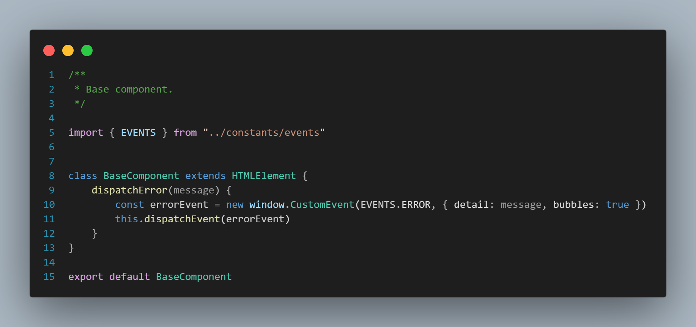

## Kapitel 11 - Systems
Jag använde mig av en komponentarkitektur i min app där jag har en huvudkomponent som
orkestrerar sub-komponenter, detta gör systemet modulärt och varje komponent har sina egna
ansvarsområden - Seperation of concerns.
Jag använder mig av dependency-injection för att skapa typen ColorPalette externt i
huvudkomponenten - color-companion application. Jag matar in instansen i palette-presenter
komponenten för att hålla den logiken inkapslad och frånkopplad från huvudkomponenten. Här
används då Inversion of Control för att flytta ansvaret till palette-presenter att använda
ColorPalette.

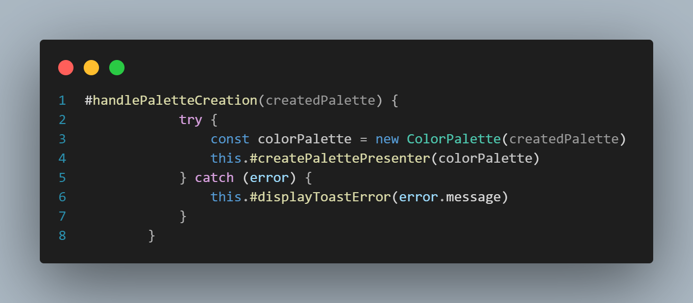
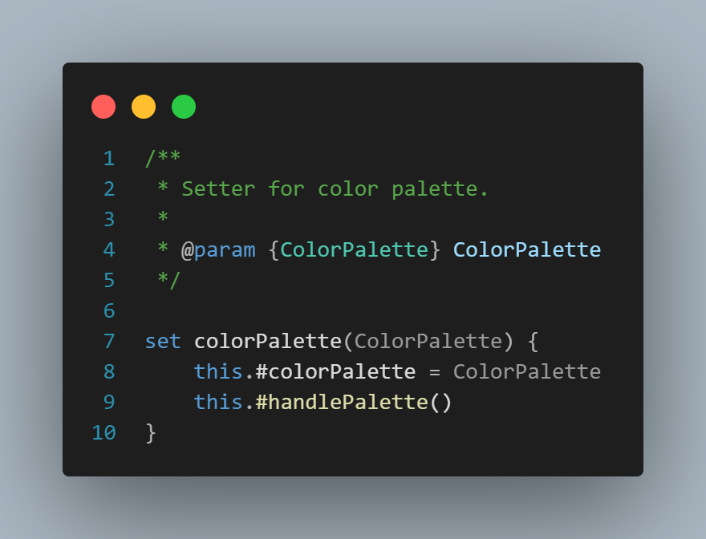
