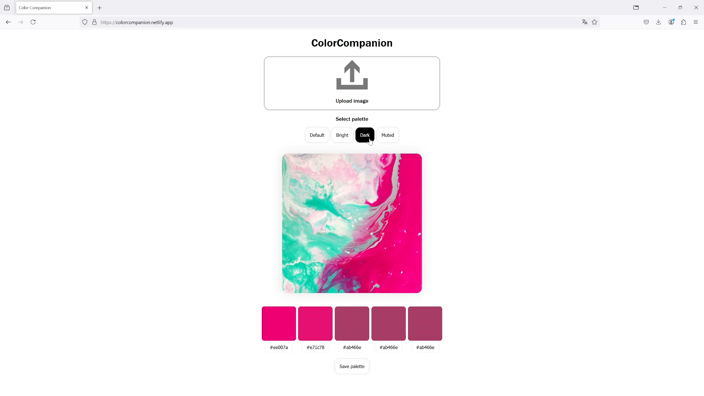
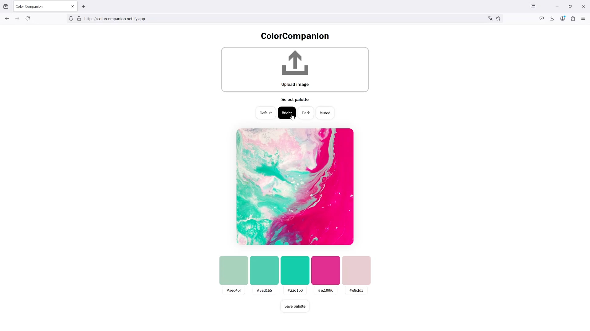

### Testrapport 
Samlade testfall: [Testfall](testfall.md)
> * 25/10/2024
> * ColorCompanion - Version 1.0.0
> * Miljö: Produktion - Netlify
> * Webbläsare: Firefox 131.0.3 (64-bitars)

| Test               | UC1 |
|--------------------|-----|
| 1.1                | OK  |
| Coverage & Success | 1/1 |

| Test               | UC2 |
|--------------------|-----|
| 2.1                | OK  |
| 2.2                | OK  |
| 2.3                | OK  |
| 2.4                | OK  |
| Coverage & Success | 4/4 |

| Test               | UC3 |
|--------------------|-----|
| 3.1                | OK  |
| 3.2                | OK  |
| 3.3                | OK  |
| 3.4                | OK  |
| 3.5                | OK  |
| 3.6                | OK  |
| 3.7                | OK  |
| Coverage & Success | 7/7 |

| Test               | UC4 |
|--------------------|-----|
| 4.1                | OK  |
| 4.2                | OK  |
| 4.3                | OK  |
| Coverage & Success | 3/3 |

| Test               | UC5 |
|--------------------|-----|
| 5.1                | OK  |
| Coverage & Success | 1/1 |

# UC1 - Navigering

> ## Testfall 1.1
>
> ### Input
>
> Navigera till webbapplikationen
>
> ### Output
>
> Webbapplikationens startsida visas med en uppladdningsikon.

# UC2 - Uppladdning av bild

> ## Testfall 2.1 - Lyckad uppladdning via filväljare
>
> ### Input
>
> * Testfall 1.1 - Navigera till webapp
> * Tryck på Uppladdningsikonen
> * Välj en bildfil
>
> ### Output
>
> * Bilden visas på sidan

>
> ## Testfall 2.2 - Misslyckad uppladdning via filväljare
>
> ### Input
>
> * Testfall 1.1 - Navigera till webapp
> * Tryck på Uppladdningsikonen
> * Välj en icke-bildfil
>
> ### Output
>
> * Ett Error meddelande visas
> * Användaren kan försöka igen

>
> ## Testfall 2.3 - Lyckad uppladdning via drag & drop
>
> ### Input
>
> * Testfall 1.1 - Navigera till webapp
> * Drag och släpp en bildfil på Uppladdningsikonen
>
> ### Output
>
> * Bilden visas på sidan

> ## Testfall 2.4 - Misslyckad uppladdning via drag & drop
>
> ### Input
>
> * Testfall 1.1 - Navigera till webapp
> * Drag och släpp en icke-bildfil på Uppladdningsikonen
>
> ### Output
>
> * Ett Error meddelande visas
> * Användaren kan försöka igen
>

# UC3 - Visning av färgpalett

> ## Testfall 3.1 - Lyckad visning
>
> ### Input
>
> * Testfall 2.1 eller Testfall 2.3 - Lyckad bild uppladdning
>
> ### Output
>
> * En färgpalett med 5 färger visas
> * Under paletten syns en spara knapp

> ## Testfall 3.2 - Misslyckad visning
>
> ### Input
>
> * Testfall 2.1 eller Testfall 2.3 - Lyckad bild uppladdning
>
> ### Output
>  
> * Bilden visas på sidan
> * Ingen färgpalett visas
> * Ett Error meddelande visas 

> ## Testfall 3.3 - Lyckad visning av Muted palett
>
> ### Input
>
> * Testfall 2.1 eller Testfall 2.3 - Lyckad bild uppladdning
> * Tryck på "Muted" knappen
>
> ### Output
>
> * "Muted" knappen markeras
> * En färgpalett med 5 färger visas
> * Under paletten syns en spara knapp

> ## Testfall 3.4 - Lyckad visning av Dark palett
>
> ### Input
>
> * Testfall 2.1 eller Testfall 2.3 - Lyckad bild uppladdning
> * Tryck på "Dark" knappen
>
> ### Output
>
> * "Dark" knappen markeras
> * En färgpalett med 5 färger visas
> * Under paletten syns en spara knapp

> ## Testfall 3.5 - Lyckad visning av Bright palett
>
> ### Input
>
> * Testfall 2.1 eller Testfall 2.3 - Lyckad bild uppladdning
> * Tryck på "Bright" knappen
>
> ### Output
>
> * "Bright" knappen markeras
> * En färgpalett med 5 färger visas
> * Under paletten syns en spara knapp

> ## Testfall 3.6 - Lyckad visning av Default palett
>
> ### Input
>
> * Testfall 2.1 eller Testfall 2.3 - Lyckad bild uppladdning
> * Tryck på "Default" knappen
>
> ### Output
>
> * "Default" knappen markeras
> * En färgpalett med 5 färger visas
> * Under paletten syns en spara knapp

> ## Testfall 3.7 - Lyckad visning av palett med få färger
>
> ### Input
>
> * Testfall 2.1 eller Testfall 2.3 - Lyckad bild uppladdning - Med få färger - 3st
>
> ### Output
>
> * En färgpalett med 5 färger visas
> * Den tredje färgen upprepas två gånger
> * Under paletten syns en spara knapp

# UC4 - Kopiera HEX värden

> ## Testfall 4.1 - Lyckad visning av HEX värde
>
> ### Input
>
> * Testfall 3.1 - Lyckad visning av färgpalett
>
> ### Output
>
> * Knappar med hex värden visas under färgen

> ## Testfall 4.2 - Lyckad kopiering av HEX värde
>
> ### Input
>
> * Testfall 4.1 - Lyckad visning av HEX värde
> * Tryck på första knappen med hex värde
>
> ### Output
>
> * Info meddelande visar att kopiering lyckades
> * HEX värdet ligger i urklipp och kan klistras in - ctrl + v

> ## Testfall 4.3 - Lyckad inklistring av HEX värde
>
> ### Input
>
> * Testfall 4.1 - Lyckad visning av HEX värde
> * Testfall 4.2 - Lyckad kopiering av HEX värde
> * Klistra in hex värdet i ett textfält - ctrl + v
> ### Output
>
> * HEX värdet klistras in

# UC5 - Nedladdning av färgpalett

> ## Testfall 5.1 - Lyckad sparning av färgpalett
>
> ### Input
>
> * Testdall 3.1 - Lyckad visning av färgpalett
> * Tryck på "Spara" knappen
>
> ### Output
>
> * Paletten sparas ned som en bild - palette.png

